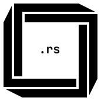

<div align="center">
    <a href="https://github.com/ragagno/neutronium-rust"></a>
    <h3 align="center">Neutronium</h3>
    <p align="center">Neutronium is a project template.</p>
</div>

<details>
    <summary>Table of Contents</summary>
    <ul>
        <li>
            <a href="#about-the-project">About the project</a>
        </li>
        <li>
            <a href="#getting-started">Getting started</a>
            <ul>
                <li>
                    <a href="#prerequisites">Prerequisites</a>
                </li>
                <li>
                    <a href="#installation">Installation</a>
                </li>
                <li>
                    <a href="#usage">Usage</a>
                </li>
            </ul>
        </li>
        <li>
            <a href="#roadmap">Roadmap</a>
        </li>
        <li>
            <a href="#contributing">Contributing</a>
        </li>
        <li>
            <a href="#acknowledgments">Acknowledgments</a>
        </li>
        <li>
            <a href="#contact">Contact</a>
        </li>
        <li>
            <a href="#license">License</a>
        </li>
    </ul>
</details>

## About the project

[![Neutronium Screenshot][project-splash]](https://github.com/ragagno/neutronium-rust)

This repository is a template for a project using the Rust programming language.
It contains a hello world program, readme, license and other files that you would want in any project.

## Getting started

To get started with this project, decide where you will place your local repository and follow these simple steps.

### Prerequisites

You need to have a working git installation, a JVM and the Rust compiler.

### Installation

1. Clone this repository
    ```sh
    git clone https://gitlab.com/ragagno/neutronium-rust.git
    ```
2. Rename the directory
3. Edit the files `README.md`, `CHANGELOG.md`, `LICENSE`... and `.gitignore` depending on if you build a library or a binary
4. Start working on your project

### Usage

I recommend that you developr your project in [Rust Rover](https://www.jetbrains.com/rust) as it is the best Rust IDE there is.

If you prefer basic text editors like [JetBrains Fleet](https://www.jetbrains.com/fleet) or [Visual Studio Code](https://code.visualstudio.com), you can compile the project using the following commands.

```sh
cargo build
```

## Roadmap

- [x] Make Neutronium available for other languages
    - [x] [C](https://github.com/ragagno/neutronium-c)
    - [x] [C++](https://github.com/ragagno/neutronium-cpp)
    - [x] [kotlin](https://github.com/ragagno/neutronium-kotlin)
    - [x] [Lua](https://github.com/ragagno/neutronium-lua)
    - [x] [Rust](https://github.com/ragagno/neutronium-rust)
- [ ] Use [Chisel](https://github.com/ragagno/chisel) when it is stable

See the [open issues](https://gitlab.com/ragagno/neutronium-rust/-/issues) for a list of feature requests and known problems.

## Contributing

Contributions are the backbone of the open source community and are greatly appreciated.
You can contribute in several manners.

The first one is to propose a pull request to the project for improving its features directly.

The second one is to open an issue when you encounter a bug or have a feature request.

The third one is to financially support the development of the project.
If you feel like it, you can buy me a coffee on [Ko-Fi](https://ko-fi.com/ragagno).

## License

Copyright (c) 2023-present Ragagno

Distributed under the MIT License. See `LICENSE.txt` for more information.

*Note that this project is not actually under any license, and this part serves only as a placeholder for your license.*

I recommend the [MIT License](https://choosealicense.com/licenses/mit) or the [GNU AGPL](https://choosealicense.com/licenses/agpl-3.0).
If you want more choices, GitHub made a [website](https://choosealicense.com) that compares common licenses.

## Contact

Ragagno - [@ragocraft](https://twitter.com/ragocraft) - [ragocraft@gmail.com](mailto:ragocraft@gmail.com)

Project Link: <https://gitlab.com/ragagno/neutronium-rust>

## Acknowledgments

This project would not have been possible without [Markdown](https://en.wikipedia.org/wiki/Markdown) and [JetBrains Fleet](https://www.jetbrains.com/fleet).

A special thanks to the contributor of the project:
* [John Doe](https://www.youtube.com/watch?v=dQw4w9WgXcQ)
* [Jane Doe](https://www.youtube.com/watch?v=dQw4w9WgXcQ)

[project-logo]: ../resources/logo.svg
[project-splash]: ../resources/splash.svg
